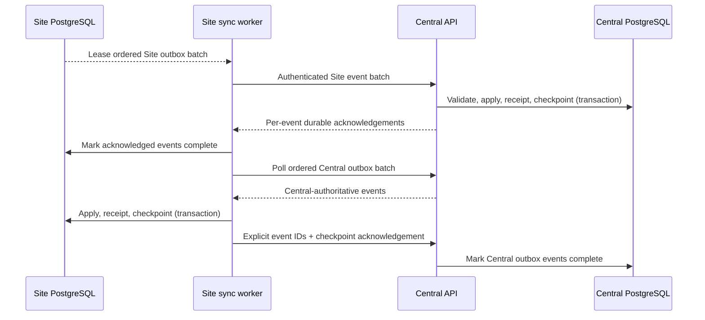

# ADR-0006: Central/Site registration and synchronization

**Status:** Accepted
**Date:** 2026-08-10

## Context

Central and every Site are independent deployments with separate PostgreSQL databases and
lifecycles. Sites must continue operating through WAN outages, while future synchronized domains
need authenticated, resumable, idempotent transport without direct database access.

## Decision

Each Site bootstraps one `local_site_identity` row with a permanent UUID. Display name and network
metadata are mutable attributes, never identity. Central keeps a registry record with explicit
`pending`, `active`, `rejected`, `revoked`, and `disabled` states.

Enrollment uses a Site-generated high-entropy claim secret and a Central-generated one-time poll
token. Central stores only SHA-256 hashes. After administrator approval, the authenticated poll is
allowed to receive a per-Site bearer credential derived with HMAC-SHA-256 from a deployment issuer
key and the enrollment identity. This makes a lost approval response safely recoverable while the
one-time poll grant remains valid. Central stores only its hash and the Site stores the
credential encrypted with a deployment-provided key. Verification uses constant-time comparison.
Revocation invalidates all active credentials. Caddy terminates HTTPS; mTLS can later be required
at Caddy without changing the application protocol.

Synchronization protocol version 1 uses at-least-once delivery. Stable event envelopes contain a
UUID event ID, source, authority, durable source sequence, entity identity, occurrence time,
versioned payload, and optional correlation/causation IDs. Timestamps are not cursors.

Sites push Site-authoritative events to Central and poll Central for Central-authoritative events.
The receiver validates identity, protocol, schema, authority, and sequence; applies the event and
records its receipt/checkpoint in one PostgreSQL transaction; only then does it acknowledge.
Duplicate event IDs return successful duplicate acknowledgements. Central events remain in its
outbox until the Site durably applies and explicitly acknowledges them.

Transient transport failures use the existing leased outbox and bounded exponential retry.
Authentication, revocation, schema, ownership, and protocol errors are permanent and visible in
registration/outbox diagnostics. Site-local operation never depends on heartbeat or Central.

### Ownership

- `site.heartbeat` and `site.metadata.updated` are authoritative at the identified Site.
- `site.configuration.updated` is authoritative at Central.
- Non-authoritative writes are rejected; there is no generic last-write-wins behavior.

## Registration sequence

```mermaid
sequenceDiagram
    participant S as Site sync worker
    participant SDB as Site PostgreSQL
    participant C as Central API
    participant CDB as Central PostgreSQL
    participant A as Central administrator
    S->>SDB: Bootstrap/read permanent site_id
    S->>C: Enrollment request (site_id + claim proof)
    C->>CDB: Upsert pending registry + hashed claim/poll token
    C-->>S: Pending + one-time poll token
    S->>SDB: Encrypt and store poll token
    A->>C: Approve pending Site
    C->>CDB: Commit active state + audit
    S->>C: Poll status with poll token
    C->>CDB: Store hash of new per-Site credential
    C-->>S: Credential (delivered once)
    S->>SDB: Encrypt credential; remove claim material
```

## Normal synchronization sequence



## Consequences and production hardening

Co-located stacks share only an explicit Docker integration network. Separately hosted stacks use
the same URLs over HTTPS. Production deployments must use Caddy TLS, protect the Site encryption
key and Central administrator token with the platform secret mechanism, rotate them under an
operational procedure, and add Caddy-managed client certificates when mTLS enrollment is adopted.
